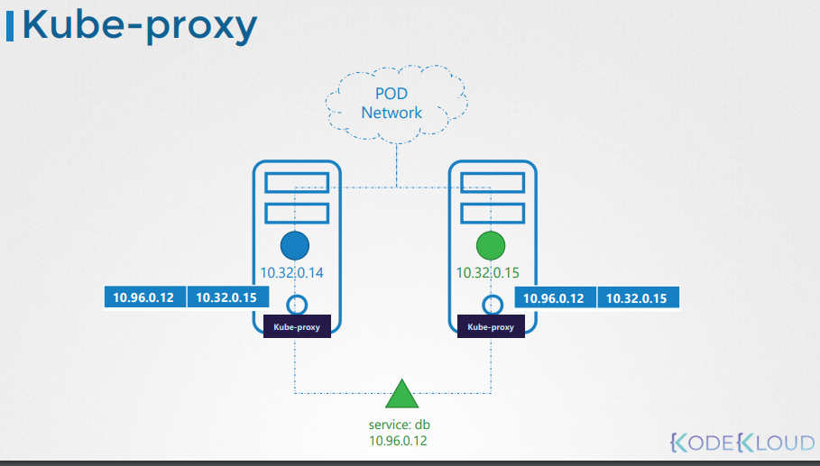

# Kube Proxy
- Take me to [Video Tutorial](https://kodekloud.com/topic/kube-proxy/)

In this section, we will take a look at kube-proxy.

Within Kubernetes Cluster, every pod can reach every other pod, this is accomplish by deploying a pod networking cluster to the cluster. 
virtual network that spans across all the nodes in the cluster to which all the PODs connect to.
There are many solutions available for deploying such a network.
In this case I have a web application deployed on the first node and a database application deployed on the second.
The web app can reach the database, simply by using the IP of the database POD.
But there is no guarantee that the IP of the database part will always remain the same.
A better way for the web application to access the database is using a service. So we create a service to expose the database application across the cluster.
The web application can now access the database using the name of the service db.
The service also gets an IP address assigned to it whenever a pod tries to reach the service using its IP or name it forwards the traffic to the back end pod.

- Kube-Proxy is a process that runs on each node in the kubernetes cluster.
Its job is to look for new services and every time a new service is created it creates the appropriate rules on each node to forward traffic to those services to the backend pods.One way it does this is using IPTABLES rules.
In this case it creates an IP tables rule on each node in the cluster to forward traffic heading to the IP of the service which is 10.96.0.12 to the IP of the actual pod which is 10.32.0.15. 
  
  
  
## Install kube-proxy - Manual
- Download the kube-proxy binary from the kubernetes release pages [kube-proxy](https://storage.googleapis.com/kubernetes-release/release/v1.13.0/bin/linux/amd64/kube-proxy). For example: To download kube-proxy v1.13.0, Run the below command.
  ```
  $ wget https://storage.googleapis.com/kubernetes-release/release/v1.13.0/bin/linux/amd64/kube-proxy
  ```
- Extract it
- Run it as a service

  

## View kube-proxy options - kubeadm
- If you set it up with kubeadm tool, kubeadm tool will deploy the kube-proxy as pod in kube-system namespace. In fact it is deployed as a daemonset on master node.
  ```
  $ kubectl get pods -n kube-system
  ```
  
  
  
K8s Reference Docs:
- https://kubernetes.io/docs/reference/command-line-tools-reference/kube-proxy/
- https://kubernetes.io/docs/concepts/overview/components/
